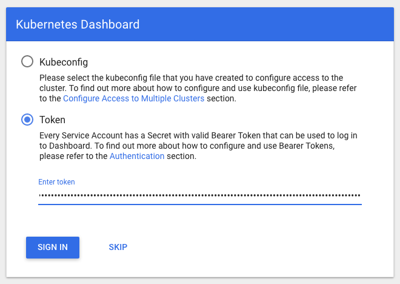

# AWS EKS cluster with persistent storage EBS/EFS

Deploy a AWS EKS cluster with persistent storage EBS (Dynamic Storage) and EFS.


## Prerequisites
```md
terraform (version : 0.11.14)
kubctl
aws-iam-authenticator
```


----

## What resources are created

1. VPC
2. Internet Gateway (IGW)
3. Public and Private Subnets
4. Security Groups, Route Tables and Route Table Associations
5. IAM roles, instance profiles and policies
6. EKS Cluster
7. Autoscaling group and Launch Template
8. EFS persistance storage
9. Kubernetes Dashboard


----

## How to use this example

```bash
git clone git@github.com:nitinda/terraform_eks.git
cd terraform_eks/layer
terraform init
terraform plan
terrafomr apply --auto-approve
```


## Manual Steps post deployment to access the dashboard
# Export Kubeconfig
```
export KUBECONFIG=${PWD}/kubeconfig
kubectl -n kube-system describe secret $(kubectl -n kube-system get secret | grep eks-admin | awk '{print $1}')
```
## Output:
```
Name:         eks-admin-token-b5zv4
Namespace:    kube-system
Labels:       <none>
Annotations:  kubernetes.io/service-account.name=eks-admin
              kubernetes.io/service-account.uid=bcfe66ac-39be-11e8-97e8-026dce96b6e8

Type:  kubernetes.io/service-account-token

Data
====
ca.crt:     1025 bytes
namespace:  11 bytes
token:      <authentication_token>
```

## Start the kubectl proxy
```
kubectl proxy
```
Open the following link with a web browser to access the dashboard endpoint: http://localhost:8001/api/v1/namespaces/kube-system/services/https:kubernetes-dashboard:/roxy/#!/login



----

## Diagram

Working in progress

----

## Cleaning up

You can destroy this cluster entirely by running:

```bash
terraform plan -destroy
terraform destroy --force --auto-approve
```